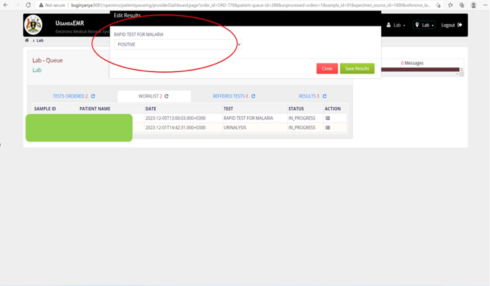

# Optimization of the Electronic Medical Records (EMR) Point of Care System at Health Facilities in Uganda.
## Objective
This project aimed at implementing the EMR Point of Care system at selected health facilities with a focus on improving data management and clinic workflows, especially in the ART clinic.
## Key Activities: 
### Needs Assessment 
- Conducted an assessment with the ART team to identify workflow inefficiencies and skills gaps, leading to the development of a targeted training plan.
### Training on Health Information Systems Utilization 
- Delivered hands-on training for health workers on system functionalities, including patient triage, data entry, and report generation.
- Provided basic computer skills training to ensure effective system adoption.
### EMR System Installation & Configuration
- Led the installation and configuration of the EMR system, ensuring proper setup, network connectivity, and secure user access.
### Evaluation & Feedback
- Conducted a feedback session to evaluate training effectiveness and identify areas for future improvement.
## Outcome:
- The EMR POC system was successfully optimized and rolled out which enhanced data management and patient care in the ART clinic. 
- The health workers were fully trained, and the system was operational within the set timeline. 
- Recommendations were made for infrastructure improvements to support the system’s sustainability.
## Tools and technologies used: 
- EMR Point of Care System.
- Microsoft Excel and Word for documentation
- Basic Information Technology tools for training
## Visuals of the Optimization of the EMR Point of Care System

